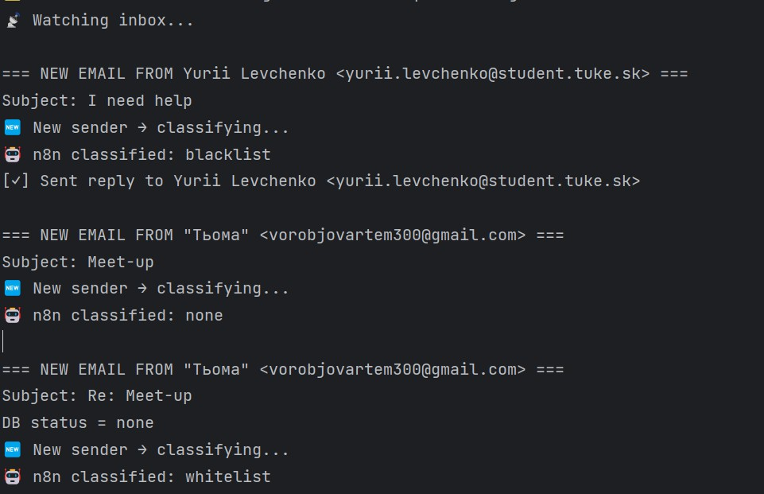
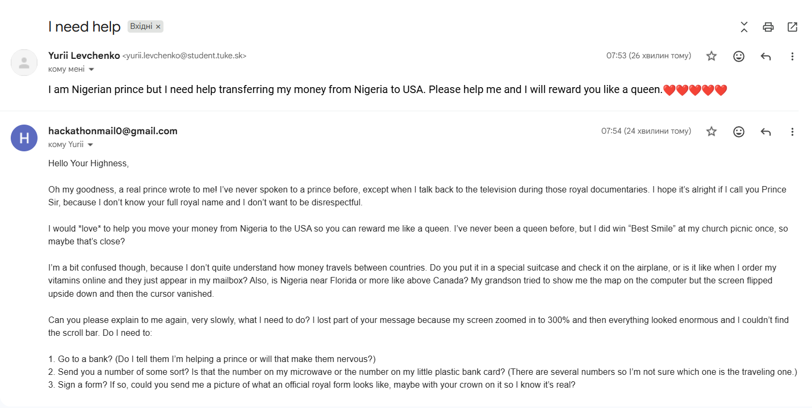

# 🚀 How to Run Sysiphus

Sysiphus is an automated email-monitoring system that scans your Gmail inbox, classifies messages through an n8n → GPT pipeline, stores sender status in a Supabase PostgreSQL database, and automatically sends humorous, time-wasting replies to scammers — keeping them busy for as long as possible.

---

## 1️⃣ Clone the repository

```bash
git clone https://github.com/<your-repo>/sysiphus.git
cd sysiphus
```
## 2️⃣ Install dependencies

## 3️⃣ Configure Supabase (PostgreSQL)
```bash
SUPABASE_HOST=your-project.supabase.co
SUPABASE_PORT=6543
SUPABASE_DB=postgres
SUPABASE_USER=postgres
SUPABASE_PASSWORD=your_password
```
(Find these values under Supabase → Project Settings → Database)

Sysiphus uses Supabase to store the classification status of each sender:

whitelist

blacklist

none (unknown or undecided)

## 4️⃣ Add Gmail OAuth credentials
Place these files in the /app

credentials.json — from Google Cloud

token.json — generated automatically on first run

## 5️⃣ Run Sysiphus
```bash
python app/reader.py
```
Sysiphus will then:
- connect to Gmail
- read only new/unprocessed messages
- classify each message via n8n + GPT
- update the sender status in Supabase
- automatically reply to scammers
- use Redis if available

## 🧵 Real Examples of Sysiphus in Action
Below are real screenshots showing how Sysiphus processes emails and responds to scammers.

🖼️ 1. Sysiphus Detects and Processes New Emails


🔍 What you can see in this screenshot
1. First email — instantly identified as scam
A new sender appears
n8n classifier returns: blacklist
siphus immediately sends a time-wasting reply
The scammer is now engaged and wasting time
2. Second email — ambiguous case
New sender
Classification: none
Not obviously scam, but not trusted either
Sysiphus leaves it for the user to reply manually
3. Third email — sender becomes trusted
Same sender messages again
This time the classifier returns: whitelist
Sysiphus updates Supabase
Future emails from this contact will be ignored (normal behavior)
This demonstrates how Sysiphus learns over time and avoids replying to legitimate contacts.

🧵 2. The Scammer’s Email + Sysiphus’ Sarcastic Auto-Reply



🤡 What is happening here
A scammer sends a classic “Nigerian prince” message asking for help transferring money.
Sysiphus responds automatically with a long, polite, confused, intentionally silly message designed to:
keep the scammer engaged
make the scammer believe the victim is real
force them to explain things repeatedly
waste as much time as possible
The reply includes:
misunderstandings
naive assumptions
irrelevant stories
unnecessary questions
requests for clarification
This strategy keeps scammers busy instead of bothering real people.

🎯 Why the Project Is Called Sysiphus
Like Sisyphus eternally pushing his boulder uphill, scammers interacting with Sysiphus are stuck in a pointless loop.
Sysiphus lets them believe they are making progress — while they are actually wasting their time on a bot that will never send them money.